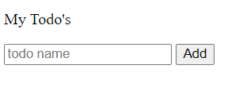
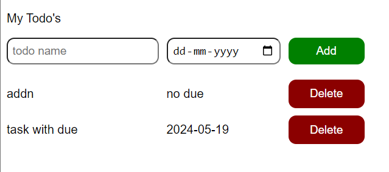

# 📝  Simple To-Do List Bonanza

Welcome to my To-Do List project! It's simple, it's functional, and it’s here to keep your tasks in check. Made with HTML, CSS, and JavaScript because why not?

## 🌟 Current Features

- **Add Tasks**: Because we all need more to do, right? ✅
- **Due Dates**: For the procrastinators among us.✅
- **Delete Tasks**: Poof! They’re gone. ✅
  


## 📸 Milestone's Sneak Peek

<figure>
  
  <figcaption>Version 0</figcaption>
</figure>
<figure>
  
  <figcaption>Version 1</figcaption>
</figure>

## 🚀 How to Get Started

1. **Clone this bad boy**
    ```bash
    git clone https://github.com/yourusername/todolist.git
    ```
2. **Open Sesame**
    ```bash
    cd todolist
    open index.html
    ```

## 🛠️ Built With

- **HTML**: Skeleton
- **CSS**: Makeup
- **JavaScript**: Brain

## 🎓 Stuff I Used to Learn

- [JavaScript Tutorial](https://youtu.be/EerdGm-ehJQ?t=29409)

## 🔮 Future Plans

- **Persistent Data**: Your tasks stick around like gum on a shoe.
- **Mark as Done**: Satisfying checkmarks included!
- **Edit Tasks**: Because who writes perfect tasks on the first try?
- **Task Priorities**: Not all tasks are created equal.


## 🤝 Wanna Help?

Fork it, clone it, improve it. PRs and issues welcome!


## 📜 License

MIT License. Do whatever you want (but please give me some credit).

---

Keep calm and keep coding! ✨
